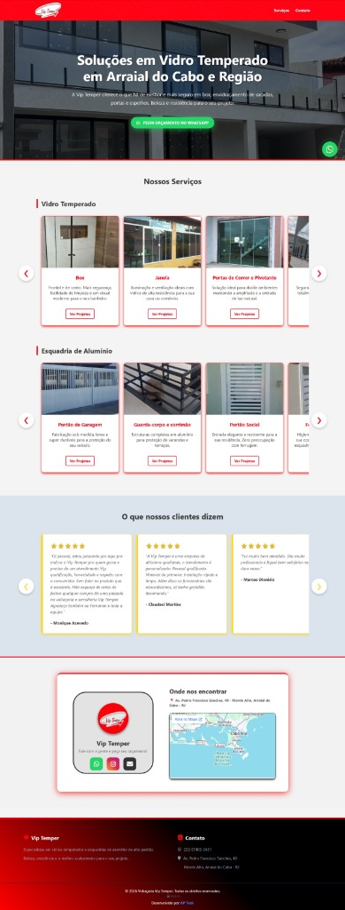
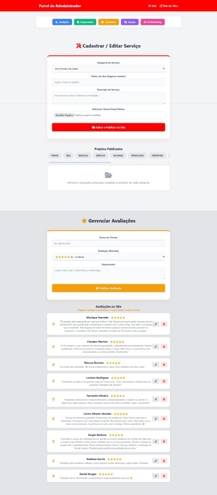
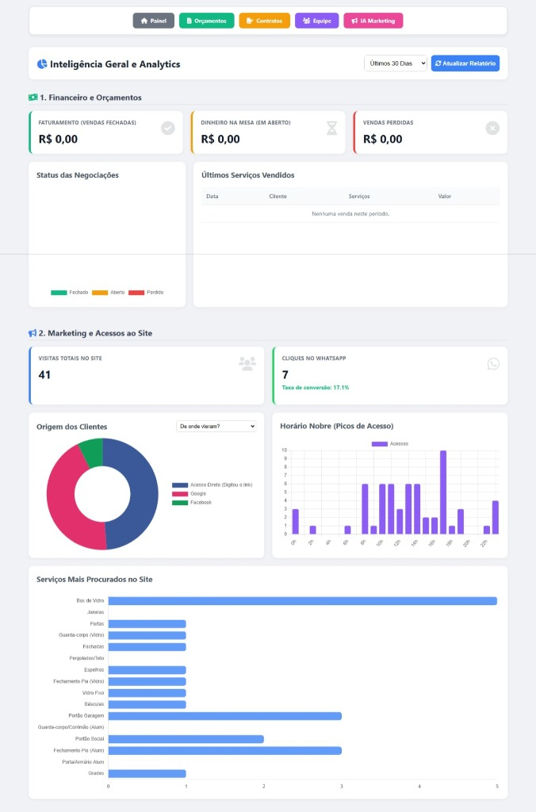
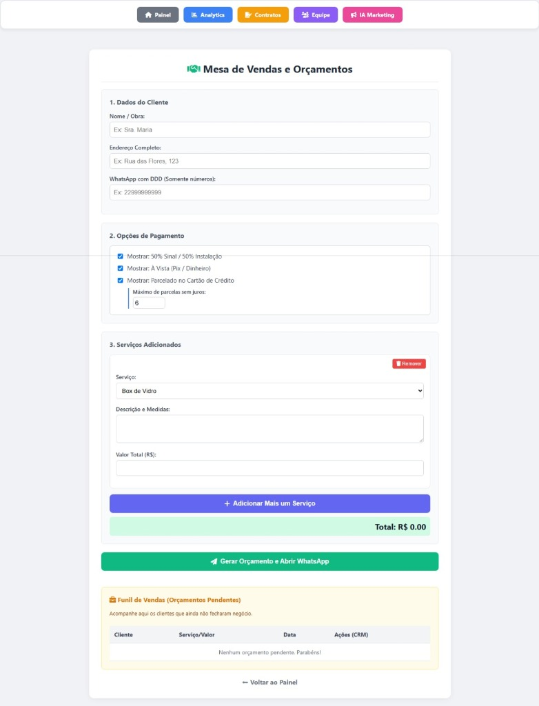

<h1 align="center">
   
  Vip Temper - Vitrine Digital e CRM
   
</h1>

<h4 align="center">Um sistema completo de landing page dinâmica, portfólio e CRM integrado para gestão de vidraçaria.</h4>

  
  
  
  

---

## 📌 Sobre o Projeto

Este repositório é uma demonstração (showcase) do sistema desenvolvido para a **Vip Temper**, uma vidraçaria e serralheria de alto padrão. O projeto foi arquitetado em duas frentes principais:
1. **Front-end Público (Vitrine):** Uma landing page focada em conversão e SEO, com portfólio dinâmico alimentado pelo painel administrativo.
2. **Back-end & CRM (Painel Restrito):** Um sistema interno robusto para gestão de orçamentos, contratos, agenda de instaladores, análise de métricas (analytics) e geração de conteúdo de marketing via Inteligência Artificial.

> **Nota de Segurança:** O código-fonte original deste projeto é mantido em um repositório privado para proteger dados sensíveis, credenciais de banco de dados e lógicas de negócio. Esta documentação serve como portfólio visual e arquitetural.

---

## 🚀 Principais Funcionalidades

*   📊 **Dashboard de Analytics:** Visão geral de faturamento, vendas perdidas e funil de conversão (acessos vs. cliques no WhatsApp).
*   💼 **CRM de Vendas e Orçamentos:** Acompanhamento do status de negociações (Pendente, Vendido, Perdido).
*   🤖 **Agência de Marketing IA:** Geração automática de legendas e copy para redes sociais utilizando a API do Google Gemini.
*   📅 **Agenda de Instalações:** Controle de fluxo de trabalho diário dos instaladores.
*   📸 **Gestão de Portfólio (Drag & Drop):** Upload de imagens via **Cloudinary** e reordenação de projetos no site em tempo real.

---

## 📱 Tour pelas Páginas do Sistema

Abaixo, detalhamos cada seção do sistema com suas respectivas telas e funções.

### 1. Landing Page (Página Inicial)
A porta de entrada do cliente. Focada em conversão, exibe os serviços oferecidos divididos em Vidro Temperado e Esquadrias de Alumínio, além de uma seção de depoimentos reais administráveis pelo painel.
 

### 2. Galeria de Projetos (Detalhes)
Página dinâmica gerada a partir dos projetos cadastrados no painel. Possui um "Lightbox" premium para visualização ampliada das fotos e vídeos.
 

### 3. Painel Administrativo (Visão Geral)
A área restrita da diretoria. Daqui, o administrador tem atalhos rápidos para o Analytics, Orçamentos, Contratos, Equipe e Marketing. Também é aqui que se faz o upload de novas fotos (Cloudinary) para o portfólio público.
 

### 4. Inteligência de Analytics
Dashboards construídos com `Chart.js` mostrando faturamento em tempo real, origens de tráfego, taxa de conversão do WhatsApp e horários de pico no site.
 

### 5. Assistente de Marketing (IA)
Uma interface conectada ao **Google Gemini**. O usuário digita o contexto de uma obra recém-concluída e a IA devolve uma legenda persuasiva e formatada (com emojis e hashtags) pronta para o Instagram.
 

### 6. CRM e Orçamentos
Tabela Kanban-style para acompanhar negociações abertas, aprovar orçamentos e gerenciar o faturamento.
 

---

## 🛠️ Arquitetura e Tecnologias

O projeto foi construído para ser leve, rápido e sem dependência excessiva de frameworks complexos, focando em performance e manutenção simplificada.

**Front-end:**
*   HTML5 semântico
*   CSS3 (Custom Properties, Flexbox, Grid)
*   JavaScript (Vanilla)
*   [Chart.js](https://www.chartjs.org/) (Gráficos)
*   [SortableJS](https://sortablejs.github.io/Sortable/) (Drag and Drop)

**Back-end:**
*   [Node.js](https://nodejs.org/) & [Express](https://expressjs.com/) (API REST)
*   [MySQL2](https://www.npmjs.com/package/mysql2) (Pool de Conexões)
*   [Cloudinary SDK](https://cloudinary.com/) (Hospedagem e otimização dinâmica de imagens)
*   [@google/generative-ai](https://www.npmjs.com/package/@google/generative-ai) (Integração com IA)

---
*Este repositório é apenas para fins de demonstração (showcase).*
